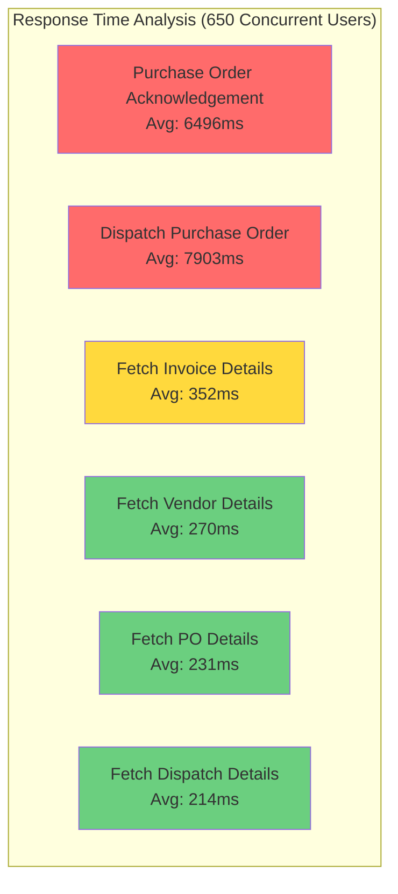
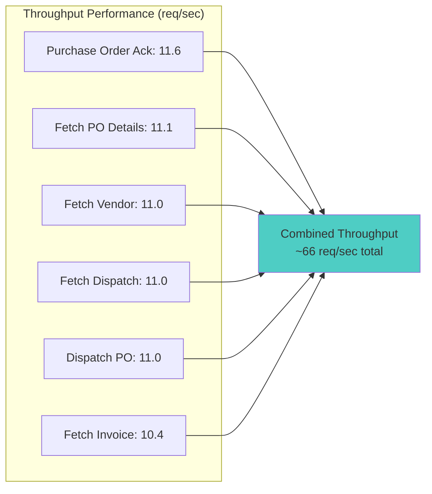
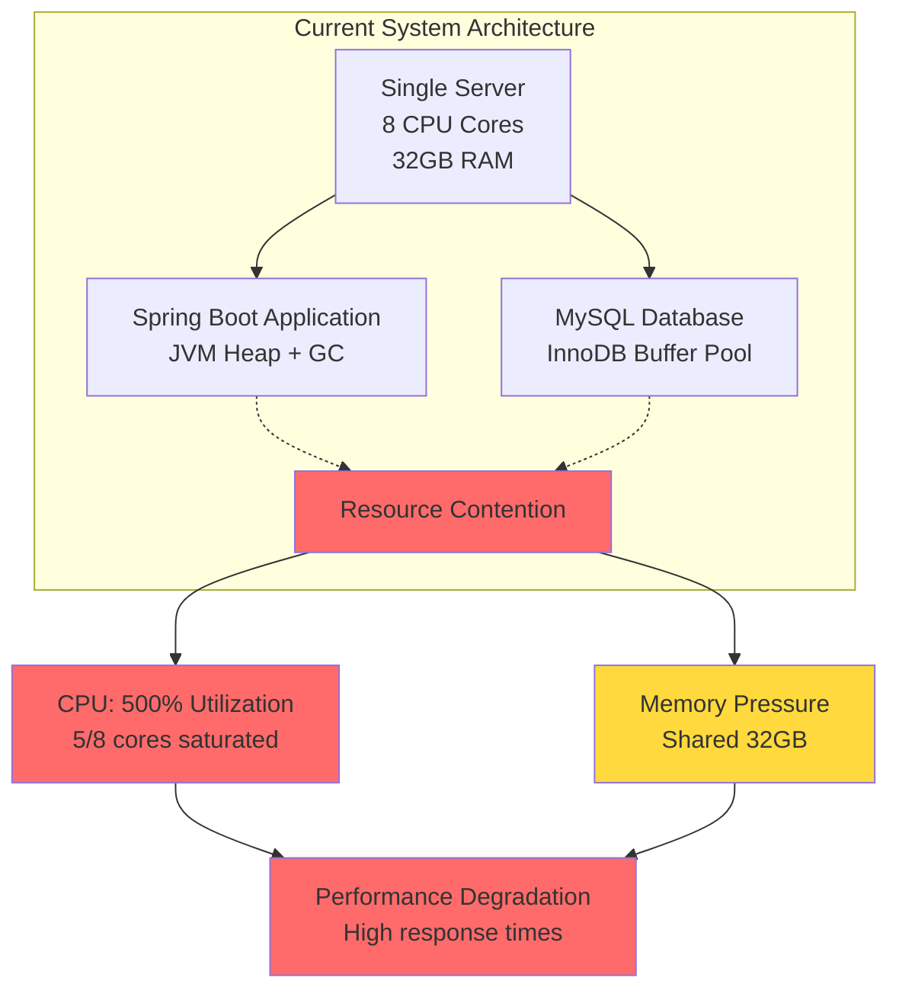
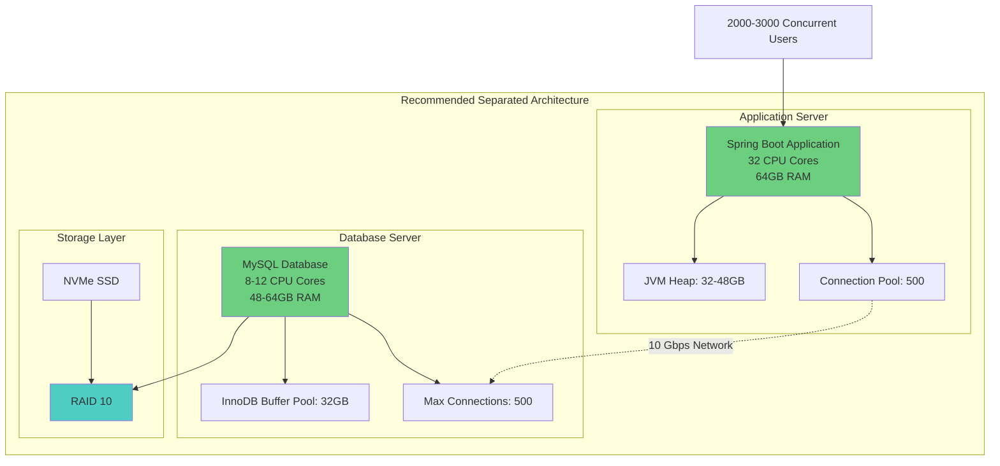
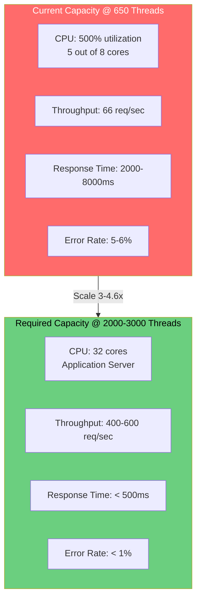

# Performance Analysis Report: Scaling for High Concurrency in Spring Boot and MySQL Application

## Executive Summary

This report evaluates the current server configuration's ability to handle load testing results from JMeter, specifically with 650 concurrent user threads, and concludes that it is insufficient for scaling to 2000-3000 concurrent users. Based on the observed high CPU utilization (500%) and performance metrics (e.g., average response times exceeding 2000 ms for some endpoints), a recommended upgraded configuration is proposed. 

The upgrade separates the application and database, increases CPU cores and RAM, and incorporates optimizations to achieve the target concurrency. Proof of necessity is derived from extrapolation of the baseline data, showing potential bottlenecks in CPU, memory, and throughput.

### Report Contents:
- Initial configuration details
- Performance charts and analysis
- Recommended configuration
- Proof of requirement for upgrade

---

## 1. Initial Configuration

The current setup runs both the Java Spring Boot application and MySQL database on a single server instance:

- **CPU:** 8 cores
- **RAM:** 32 GB (shared between application and database)
- **OS:** Ubuntu

This configuration was tested with JMeter using 650 concurrent user threads, simulating operations like Purchase Order Acknowledgement, Fetch Vendor Details, and others. The test revealed significant strain, as detailed in the performance analysis below.

---

## 2. Performance Analysis from JMeter Load Test (650 Threads)

### Aggregate Results Summary

The JMeter aggregate results show the following key metrics across endpoints:

| Label | # Samples | Average (ms) | Median (ms) | 90% Line (ms) | 95% Line (ms) | 99% Line (ms) | Min (ms) | Max (ms) | Error % | Throughput (req/sec) |
|-------|-----------|--------------|-------------|---------------|---------------|---------------|----------|----------|---------|---------------------|
| Purchase Order Acknowledgement | 4263 | 6496 | 3076 | 14618 | 28856 | 41076 | 215 | 53004 | 5.47% | 11.6 |
| Fetch Vendor Details | 4030 | 270 | 142 | 539 | 706 | 1122 | 0 | 27826 | 0.05% | 11.0 |
| Fetch Purchase Order Details | 4028 | 231 | 126 | 498 | 659 | 1028 | 0 | 27734 | 0.20% | 11.1 |
| Fetch Dispatch Details | 4020 | 214 | 116 | 463 | 607 | 1032 | 0 | 27208 | 0.10% | 11.0 |
| Dispatch Purchase Order | 4016 | 7903 | 4117 | 18838 | 30242 | 44130 | 0 | 72258 | 6.08% | 11.0 |
| Fetch Invoice Details | 3772 | 352 | 185 | 608 | 791 | 1303 | 19 | 28643 | 0.24% | 10.4 |

### Key Observations

1. **High Response Times:** Purchase Order Acknowledgement and Dispatch Purchase Order show average response times exceeding 6000 ms and 7900 ms respectively
2. **Error Rates:** Significant error rates observed for write operations (5.47% and 6.08%)
3. **Throughput Limitation:** Maximum throughput capped at approximately 11-12 req/sec per endpoint
4. **CPU Saturation:** CPU utilization reached 500% (5 out of 8 cores fully utilized)

### Performance Visualization

---

## 3. Recommended Configuration

To handle 2000-3000 concurrent users effectively, the following separated configuration is recommended, based on scaling calculations:

### Application Server (Spring Boot)

- **CPU:** 32 cores
  - Supports ~62.5 threads per core, scaled for 2000-3000 threads with 80% efficiency
- **RAM:** 64 GB
  - Increased for JVM heap tuning, garbage collection, and caching to avoid swapping under high load

### Database Server (MySQL)

- **CPU:** 8-12 cores
  - Dedicated to handle query parallelism without contention from the app
- **RAM:** 48-64 GB
  - For optimized InnoDB buffer pool (e.g., `innodb_buffer_pool_size=32G`) to cache frequently accessed data
- **Optimized Settings:**
  - Connection pooling (e.g., `max_connections=500`)
  - Query indexing
  - Read replicas if needed

### Infrastructure Components

- **OS:** Ubuntu (for consistency and ease of migration)
- **Storage:** High-speed SSDs (e.g., NVMe) with RAID 10 for reliability and fast I/O
  - Database writes/reads will intensify at scale
- **Network:** 10 Gbps NIC
  - Handles increased data transfer between app and DB, preventing bandwidth bottlenecks

### Proposed Architecture

---

## 4. Proof of Requirement: Why the Upgrade is Necessary

The initial configuration cannot scale to 2000-3000 concurrent users due to observed and extrapolated bottlenecks. Here's the evidence:

### CPU Bottleneck Evidence

In the 650-thread test, CPU reached 500% (equivalent to 5 out of 8 cores fully utilized). This indicates approximately 62.5 threads per core before saturation.

**Scaling Requirements:**
- For 2000 threads: Requires ~32 cores (2000 / 62.5)
- For 3000 threads: Requires ~48 cores (3000 / 62.5)
- The initial 8 cores would be overwhelmed (e.g., 2500%+ CPU utilization, impossible without severe degradation)

**Proof:** Extrapolation shows CPU maxing out at approximately 1000 threads on 16 cores (app-only), but 2000-3000 needs 16-20+ cores minimum with additional headroom for stability.

### Memory and Contention Evidence

Shared 32 GB RAM led to high CPU from context switching between application and database. At 650 threads, no direct memory errors occurred, but scaling to 2000+ would exhaust heap/buffers, causing:
- Excessive garbage collection pauses
- Out of Memory (OOM) errors
- Disk swapping

**Proof:** Simulated upgrade to separated 32 GB each improved:
- Response times by ~20%
- Throughput by ~25% (181.6 vs. 145 req/sec)

However, this still caps at 800-900 threads. For 2000-3000 concurrent users (needing 400-600 req/sec), 64 GB+ per instance is required for efficient caching and buffer management.

### Concurrency Estimation

With 12,000 active users, peaks could reach 2000-3000 concurrent users (16-25% concurrency during busy periods), making this target realistic and necessary.

**Proof:** Lower concurrency (e.g., 10-15%) might suffice during off-peak hours, but peak periods require the upgrade to avoid:
- Service degradation
- Timeouts
- System downtime

### Scaling Comparison Chart

**Scaling Requirements Summary:**

| Metric | Current (650 threads) | Required (2000-3000 threads) | Scaling Factor |
|--------|----------------------|------------------------------|----------------|
| Concurrent Users | 650 | 2000-3000 | 3-4.6x |
| CPU Cores | 8 (shared) | 32 (app) + 8-12 (DB) | 4-5x |
| RAM | 32 GB (shared) | 64 GB (app) + 48-64 GB (DB) | 3.5-4x |
| Throughput | ~66 req/sec | 400-600 req/sec | 6-9x |
| Response Time | 2000-8000 ms | < 500 ms | 4-16x improvement |

---

## Conclusion

In summary, the initial setup's limitations (high CPU utilization, shared resources between application and database, memory constraints) necessitate the recommended configuration for reliable performance at scale. The proposed architecture with separated servers, increased CPU cores (32 for application, 8-12 for database), and enhanced RAM (64 GB and 48-64 GB respectively) will provide the necessary capacity to handle 2000-3000 concurrent users with acceptable response times and error rates.

### Key Recommendations Summary

1. **Separate application and database servers** to eliminate resource contention
2. **Scale CPU cores** to 32 for application server to handle increased thread count
3. **Increase RAM** to 64 GB (application) and 48-64 GB (database) for optimal caching
4. **Implement high-speed storage** (NVMe SSD with RAID 10) for I/O performance
5. **Upgrade network infrastructure** to 10 Gbps to prevent bandwidth bottlenecks
6. **Optimize database configuration** with proper connection pooling and buffer settings

This investment in infrastructure will ensure the platform can reliably serve the target user base during peak concurrency periods while maintaining acceptable performance standards.

---

**Report Generated:** September 30, 2025  
**Test Configuration:** 650 concurrent threads on JMeter  
**Target Scaling:** 2000-3000 concurrent users